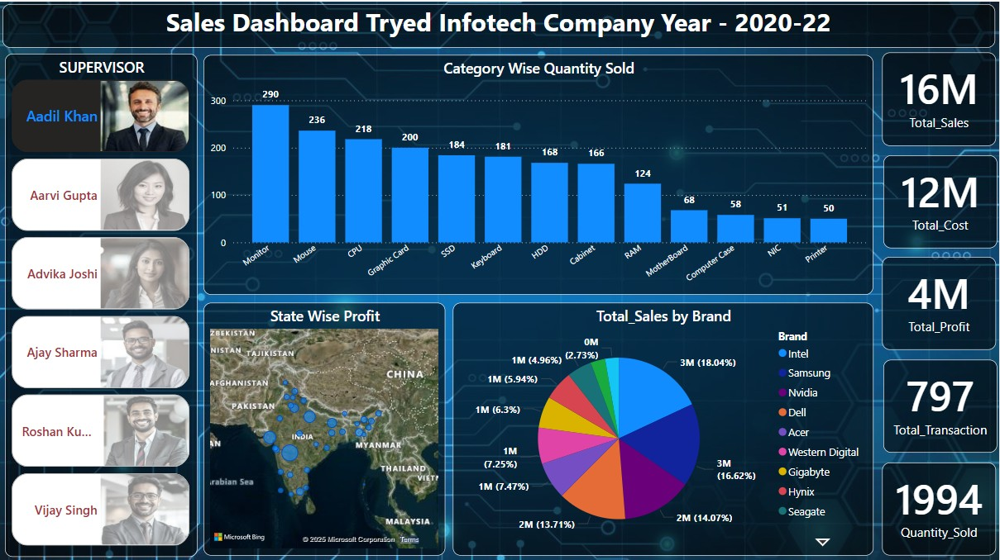

# 📊 Sales Dashboard - Power BI

## 📌 Overview
This is an interactive Power BI Sales Dashboard designed to analyze sales trends, category-wise quantities, and brand-wise distribution.

## 🔹 Features:
- **Category-wise quantity sold** visualization.
- **State-wise profit analysis** (using map visualization).
- **Total sales by brand** (pie chart visualization).
- **KPIs**: Total Sales, Total Cost, Total Profit, Transactions, and Quantity Sold.

## 🛠️ Tools Used:
- **Microsoft Power BI** – Data visualization & dashboarding
- **DAX (Data Analysis Expressions)** – Used for calculations and measures
- **SQL** – Data analysis
- **Excel/CSV** – Data source for analysis

## 📷 Screenshot:

## 📥 How to Use:
1. Download the `.pbix` file.
2. Open it in Power BI Desktop.
3. Interact with the visuals to explore insights.

📌 **Let’s Connect!** (https://www.linkedin.com/in/sujeetdatascience1/).

---

⚡ **Feedback and suggestions are welcome!** If you find this dashboard helpful, don’t forget to ⭐ **star this repository**! 🚀

